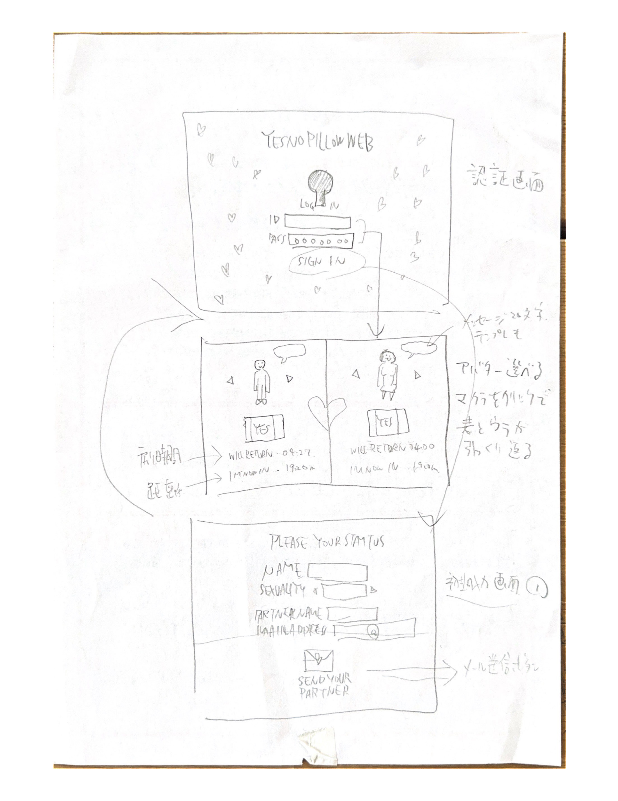
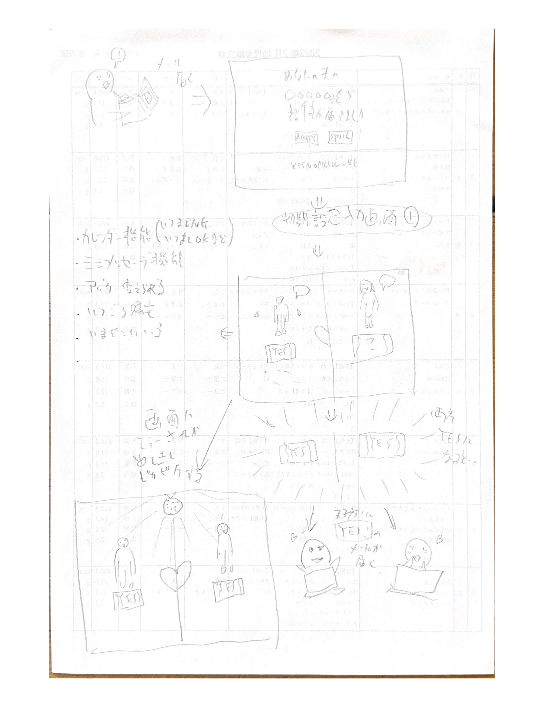

# LINELIKE_App
LINE風アプリという名のなにかを作るよ！

## ①課題内容（どんな作品か）
- タイトル：YESNOPILLOWONTHEWEB
- イエスノー枕的なカップル・夫婦向けコミュニケーションツールをウェブ上で再現してみたいと思いました

## ①-2やりたかったこと（どんな作品を目指したか）
- SIGNUP後、名前、性別（LGBTQ含む）を入力／アバターを選ぶ
- LOGIN後の画面は左右にセパレートされた画面／自分とパートナーの情報が表示される
- パートナーの入力がない場合は「SEND YOUR PARTNER」とメールアドレスの入力画面状態で片方グレーアウト
- 両方入力されると、アバターの下に枕のイラストが描かれているUIが現れる。枕には表裏に「YES」「no」と書かれてる
- 自分の枕を「YES」にすると相手に通知。20文字程度のメッセージも入れられる。テンプレメッセージもある
- テンプレメッセージ案：「ゴハンどう？」「コーヒー飲み行こうか？」「買い物付き合って」「欲しいものあるの」「散歩しよう」「映画みない？」「お風呂行こう」など

<a href="mock/scaned.pdf">pdfでもみられるぞ</a>

## ②工夫した点・こだわった点
- まずは手書きでイメージ画を作るところからスタートしてきて、コンセプトや仕様はスムーズに決まったなと
- クリックすると枕が切り替わり両方YESになると「MATCH」の表示が出てメッセージボックスが出現する。実用的なのではないかなと（何が？）

## ③難しかった点・次回トライしたいこと(又は機能)
- 見た目、CSSを最初に手をつけてしまって、Firebaseに取り組むのが遅くなってしまった。
- 「moduler」と「nameplaced」この違いがよくわからず、jsにsample.htmlのFirebase SDKを移植しても動かず四苦八苦した
- 結局、    <script type="module">　が必要ということで、けれどmoduleの宣言をしてjsに移植する気合いがなくなってしまい、index.html上で動かすことにした
- Authenticationを導入したかったが、外装を作るところまでで力尽きた。あと一歩かと思う
- 本当は男性がログインしたら男の子の枕のみを制御できて、女性もまた同じくにしたかった

## ④質問・疑問・感想、シェアしたいこと等なんでも
- [質問]いろいろ調べてもReactでの実装方法ばかりヒットしてしまい、そこから調べ始めて理解する部分が広がってしまった
- [疑問]
- [感想]
- [tips]
- [参考記事]

cssのレスポンシブ表示についてのサイズ感覚
https://www.webdeki.com/column/4031/
